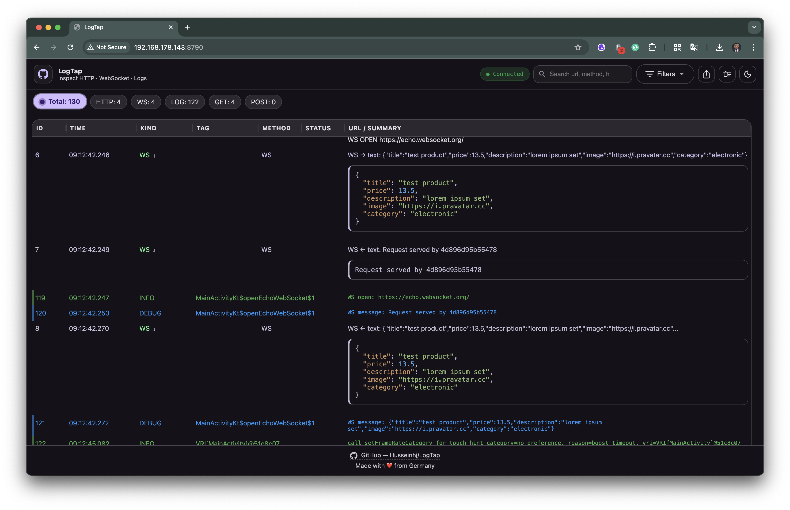
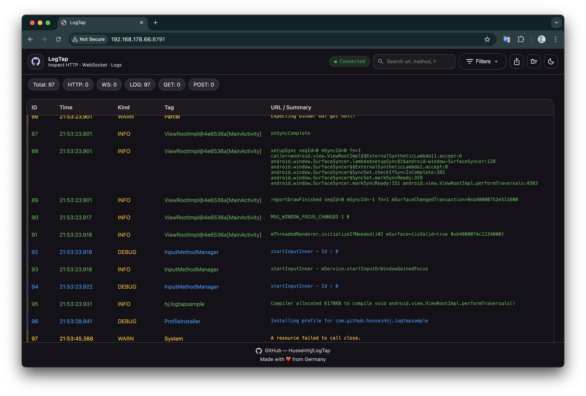
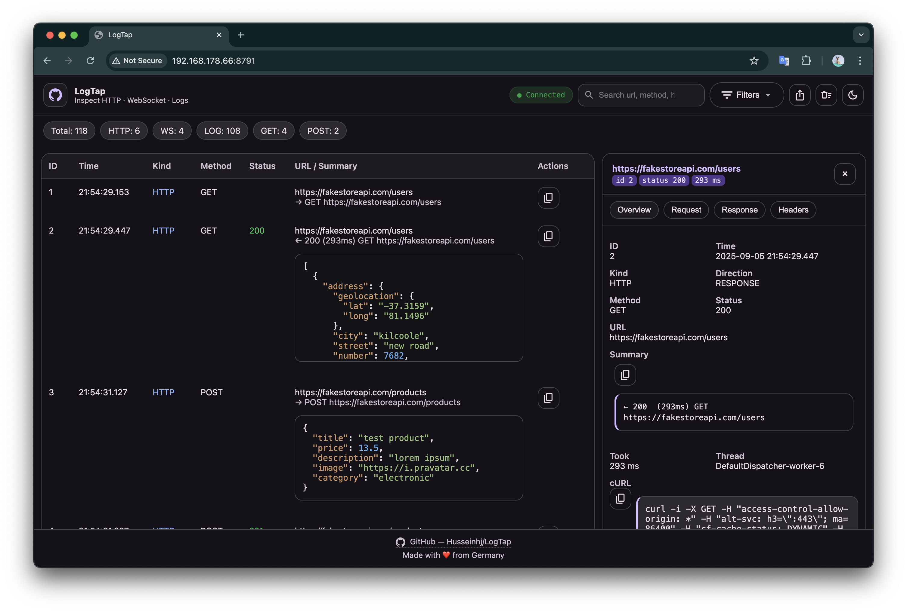
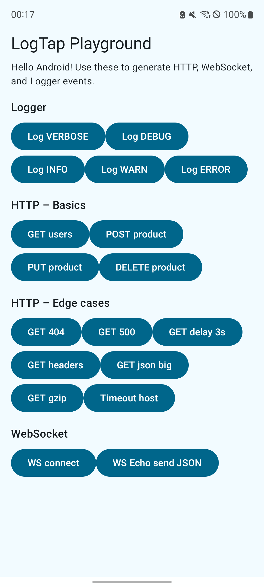

# LogTap [](https://jitpack.io/#husseinhj/Logtap)

> Realtime **HTTP / WebSocket / Logger** inspector for Android (OkHttp3) — with a built-in Ktor web server and a Material-style responsive web UI.  
> Inspect your app’s network calls and logs from any browser on the same network.

---

## 🚀 Features

- **Network**
    - OkHttp3 **Interceptor** for HTTP(S)
    - WebSocket listener proxy
    - Pretty JSON viewer
    - Copy `cURL` command for easy reproduction

- **Logger**
    - Simple logger (`LogTapLogger`) with **auto-tag by caller class**
    - Supports levels: VERBOSE, DEBUG, INFO, WARN, ERROR, ASSERT
    - Optional **Logcat bridge** to stream system logcat

- **UI**
    - Runs on device via embedded Ktor server
    - **Material-inspired**, fully responsive (desktop, tablet, mobile)
    - Modes: `Mix`, `Network only`, `Logger only`
    - Filters: Method, HTTP status code / class, Log level, Full-text search
    - Live updates via WebSocket
    - **Export JSON** or **HTML reports**
    - Copy `cURL` or Summary directly from UI
    - Auto-scroll & toggle JSON pretty-print

---

## 📸 Screenshots

| Network View | Logger View | Detail Drawer | Sample app                                |
|--------------|-------------|---------------|-------------------------------------------|
|  |  |  |  |

---

## ⚡ Usage

### Installation

Add the dependency in your `build.gradle`:

```gradle
debugImplementation 'com.github.Husseinhj.LogTap:logtap:v0.11.1'
releaseImplementation 'com.github.Husseinhj.LogTap:logtap-noop:v0.11.1'
```

> 💡 Always use the latest version from the [GitHub Releases](https://github.com/Husseinhj/LogTap/releases).

### 1. Initialize in your Application
```kotlin
class MyApp : Application() {
    override fun onCreate() {
        super.onCreate()
        if (BuildConfig.DEBUG) {
            LogTap.start(this) // Starts embedded server on port 8790
        }
    }
}
```

### 2. OkHttp with interceptor
```kotlin
val client = OkHttpClient.Builder()
    .addInterceptor(LogTapInterceptor())
    .build()
```

### 3. Logger
```kotlin
LogTapLogger.d("Something happened")
LogTapLogger.e("Network error", throwable)
```


### 4. View in browser
Open in your desktop browser:
```
http://<device-ip>:8790/
```

> **Tip – Watch Logcat for the server URL**
>
> When the embedded server is ready, LogTap writes the exact address to **Logcat** so you can copy/paste it easily. Look for a line like:
>
> ```
> ...logtapsample  I  LogTap server ready at http://192.168.178.66:8790/
> ```
>
> (If you don't see the IP, ensure your app has `ACCESS_NETWORK_STATE` or LogTap will fall back to best-effort interface detection.)

### Multiple apps at once (auto‑port increment)

If you run LogTap from **multiple apps on the same device** at the same time, LogTap will automatically try the next port when the base port is busy. By default it starts at **8790**; if that’s taken, it tries **8791**, **8792**, and so on until it finds a free port (a small, bounded range).

You’ll see the chosen address printed to **Logcat** when the server is ready, for example:

```
… I LogTap server ready at http://192.168.178.66:8790/
… I LogTap server ready at http://192.168.178.66:8791/
```

> Tip: You can also **pick different base ports** per app to avoid clashes entirely.

#### Example

**App A** – use default base port (8790):
```kotlin
class AppA : Application() {
  override fun onCreate() {
    super.onCreate()
    LogTap.start(this) // tries 8790, then 8791, ... if needed
  }
}
```

**App B** – set an explicit base port (e.g., 8795):
```kotlin
class AppB : Application() {
  override fun onCreate() {
    super.onCreate()
    LogTap.start(
      this,
      LogTap.Config(
        port = 8795,        // base port; LogTap will auto‑increment if 8795 is in use
        capacity = 5000
      )
    )
  }
}
```

Then open in your browser from the same network:

```
http://<device-ip>:8790/   // App A
http://<device-ip>:8791/   // App A (if 8790 was busy)
http://<device-ip>:8795/   // App B
http://<device-ip>:8796/   // App B (if 8795 was busy)
```

### 5. Advanced: Automatic Logcat collection

For more settings and to automatically collect logs from Android's logger, you can use `LogTapLogcatBridge` together with a `LogTapSinkAdapter`:

```kotlin
class LogTapApp : Application() {
  private val logSink = LogTapSinkAdapter()

  override fun onCreate() {
    super.onCreate()

    LogTapLogcatBridge.start(logSink)
    LogTapLogger.d("LogTapLogcatBridge started")
    LogTap.start(this, LogTap.Config(port = 8790, capacity = 5000))

    LogTapLogger.setDebug(BuildConfig.DEBUG)
    LogTapLogger.setAllowReleaseLogging(false)
    LogTapLogger.setMinLevel(
      if (BuildConfig.DEBUG)
        LogTapLogger.Level.DEBUG
      else
        LogTapLogger.Level.WARN
    )
  }
}
```

---


#### Per-flavor installation

You can restrict LogTap only to a specific build flavor (e.g., `dev`) by declaring dependencies under the corresponding configuration. For example:

```gradle
dependencies {
    devDebugImplementation 'com.github.Husseinhj.LogTap:logtap:v0.11.1'
    devReleaseImplementation 'com.github.Husseinhj.LogTap:logtap-noop:v0.11.1'
}
```

> Note: Other flavors (like `staging` or `production`) will not include LogTap unless you declare the dependency for them as well.

#### Per-flavor Kotlin code (safe stubs to avoid release deps)

Sometimes you want **no LogTap library at all in release builds** (not even the `-noop` artifact), but still keep your source code compiling. The simplest and safest way is to **wrap LogTap** behind your own tiny facade and provide a **no-op implementation** in `release` sources.

**1) Declare flavors (example)**

```gradle
android {
  flavorDimensions += "env"
  productFlavors {
    create("dev") { dimension = "env" }
    create("staging") { dimension = "env" }
    create("production") { dimension = "env" }
  }
}
```

**2) Depend only where you need it**

- If you want the library only in the `dev` flavor, keep:

```gradle
devDebugImplementation 'com.github.Husseinhj.LogTap:logtap:v0.11.1'
// (Optional) If you also build devRelease, use the noop artifact there:
devReleaseImplementation 'com.github.Husseinhj.LogTap:logtap-noop:v0.11.1'
```

- If you prefer **no dependency at all** on release variants (including prod/staging), **do not** add a release dependency. We’ll provide **stubs** instead.

**3) Create a small facade that your app calls**

_Use a single API from your app and hide LogTap behind it._

```kotlin
// src/main/java/com/example/logtap/LogTapFacade.kt
package com.example.logtap

import android.app.Application

object LogTapFacade {
  fun start(app: Application) {}
  fun d(message: String) {}
  fun e(message: String, t: Throwable? = null) {}
}
```

**4) Provide real implementation only in the flavor that needs it**

```kotlin
// src/dev/java/com/example/logtap/LogTapFacade.kt
package com.example.logtap

import android.app.Application
import com.github.husseinhj.logtap.LogTap
import com.github.husseinhj.logtap.logger.LogTapLogger

object LogTapFacade {
  fun start(app: Application) {
    LogTap.start(app)
    LogTapLogger.d("LogTap started")
  }
  fun d(message: String) = LogTapLogger.d(message)
  fun e(message: String, t: Throwable?) = LogTapLogger.e(message, t)
}
```

**5) Provide a no-op implementation for release (and/or staging, production)**

```kotlin
// src/release/java/com/example/logtap/LogTapFacade.kt
package com.example.logtap

import android.app.Application

object LogTapFacade {
  fun start(app: Application) { /* no-op */ }
  fun d(message: String) { /* no-op */ }
  fun e(message: String, t: Throwable? = null) { /* no-op */ }
}
```

> With this setup:
> - Your **app code** always calls `LogTapFacade` (never the library directly).
> - **Dev** variants get the real implementation and the actual dependency.
> - **Release/Production** variants compile against the no-op class and **ship with zero LogTap code**.

**6) Use in Application**

```kotlin
class MyApp : Application() {
  override fun onCreate() {
    super.onCreate()
    // Facade is flavor-aware; in release this is a no-op
    LogTapFacade.start(this)
  }
}
```

**7) Optional: variant-aware source sets**

You can create stubs per-flavor too, e.g. `src/production/java/...` and `src/staging/java/...` if those should also be no-op.


---

## 🔐 Security

- LogTap is meant for **debug builds only**.  
- Don’t enable it in production.  
- Use the provided `-noop` artifact in release builds.  
- You can also guard calls with `if (BuildConfig.DEBUG)`.

---

## 🛠 Development

- UI is embedded in `Resources.kt` (HTML, CSS, JS).
- Served from:
  - `/` → Main web UI
  - `/api/logs` → JSON API
  - `/ws` → WebSocket stream
- Contributions welcome! Please open an issue or PR.

---

## 📜 License

MIT License – see [LICENSE](LICENSE) for details.
