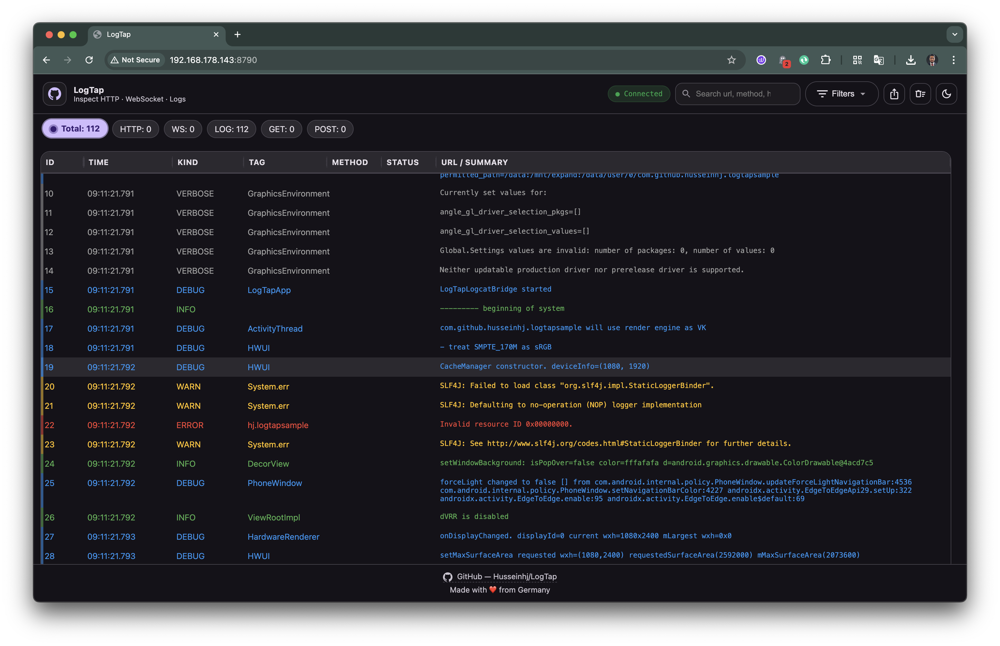
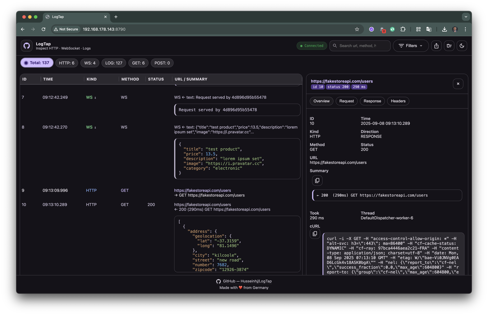

# LogTap

> Realtime **HTTP / WebSocket / Logger** inspector for Android (OkHttp3) — with a built-in Ktor web server and a Material-style responsive web UI.  
> Inspect your app’s network calls and logs from any browser on the same network.

---

## 🚀 Features

- **Network**
    - OkHttp3 **Interceptor** for HTTP(S)
    - WebSocket listener proxy
    - Pretty JSON viewer
    - Copy `cURL` command for easy reproduction

- **Logger**
    - Simple logger (`LogTapLogger`) with **auto-tag by caller class**
    - Supports levels: VERBOSE, DEBUG, INFO, WARN, ERROR, ASSERT
    - Optional **Logcat bridge** to stream system logcat

- **UI**
    - Runs on device via embedded Ktor server
    - **Material-inspired**, fully responsive (desktop, tablet, mobile)
    - Modes: `Mix`, `Network only`, `Logger only`
    - Filters: Method, HTTP status code / class, Log level, Full-text search
    - Live updates via WebSocket
    - **Export JSON** or **HTML reports**
    - Copy `cURL` or Summary directly from UI
    - Auto-scroll & toggle JSON pretty-print

---

## 📸 Screenshots

_(add screenshots here)_

| Network View | Logger View | Detail Drawer |
|--------------|-------------|---------------|
|  |  |  |

---

## 📦 Setup

Add the dependency (to be published via Maven Central):

```kotlin
dependencies {
    debugImplementation("com.github.husseinhj:logtap:<version>")
    releaseImplementation("com.github.husseinhj:logtap-noop:<version>")
}